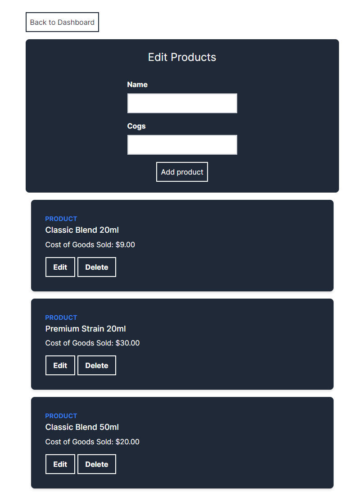
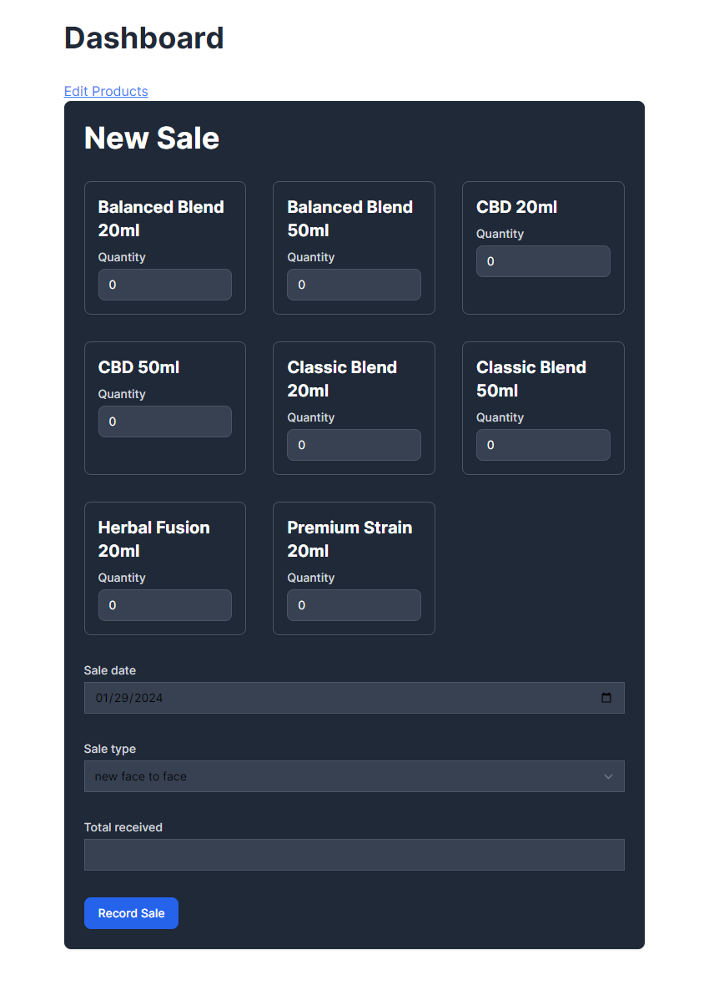
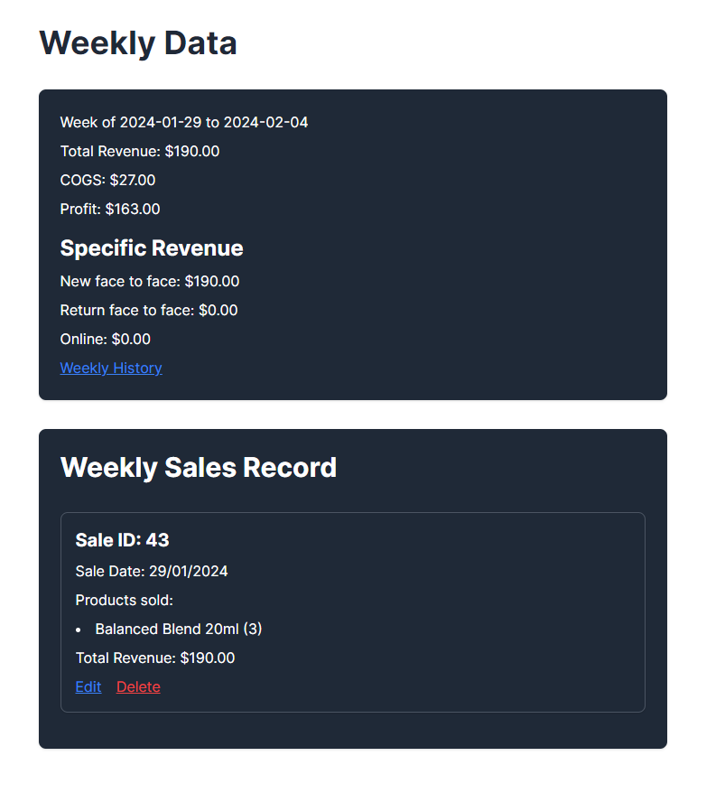
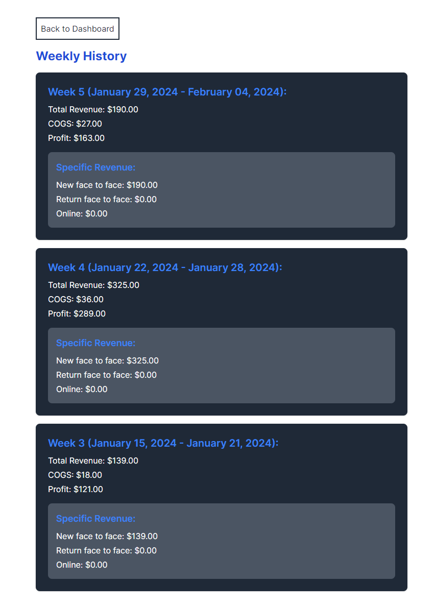

# README

This is a profit tracking application for a product business. Products can be created, edited and deleted. Each product will have COGS (Cost of Goods Sold) assigned to it. The actual sale price of a product may vary, hence the total revenue of each individual sale is entered at the time of sale, with the profit being calculated accordingly. 

I will continue improving this over time. The code is currently a bit clunky and could certainly use some re-factoring, but I'll get there in time!

## **OVERVIEW**
 

Products can be created, edited and deleted. 

Once products are created, a new sale can be made.

Each sale of the current week is displayed down the bottom of the dashboard. The weekly summary is displayed too. 

Previous weeks can be viewed in the ***weekly history*** view. 

Feel free to clone the repository and have a play, or customise it to your needs!

## **Cloning and installation**

To clone and use this repository, the following steps can be followed:

1. Clone the repository:
`git clone <repository_url>`

2. Navigate into the cloned directory:
`cd <directory_name>`

3. Install the required gems:
`bundle install`

4. Install the required node modules:
`yarn install`

5. Set up the database:
`rails db:create`
`rails db:migrate`

6. Run the server:
`bin/dev`

7. Navigate to the local server in your browser:
`localhost:3000`

Please note that these instructions assume that you have Ruby, Rails, and Yarn already installed on your system. If not, you will need to install those first.